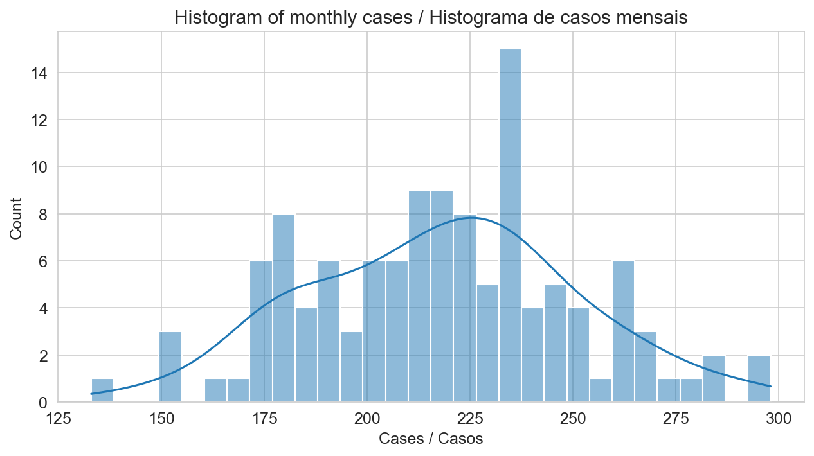
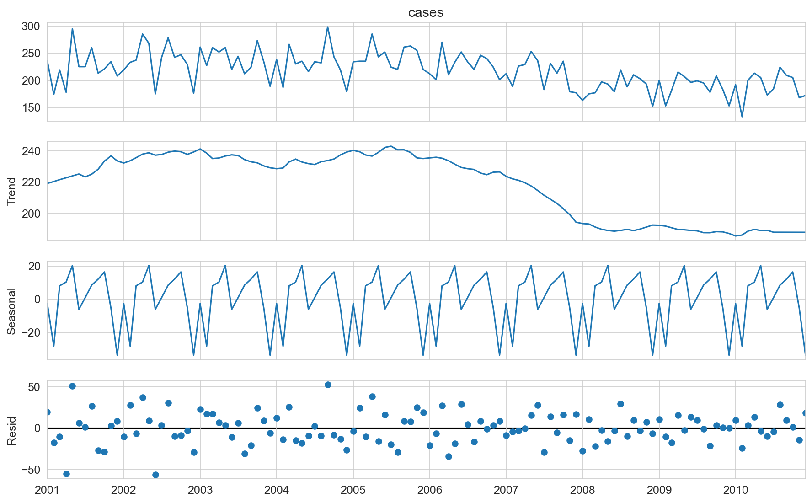
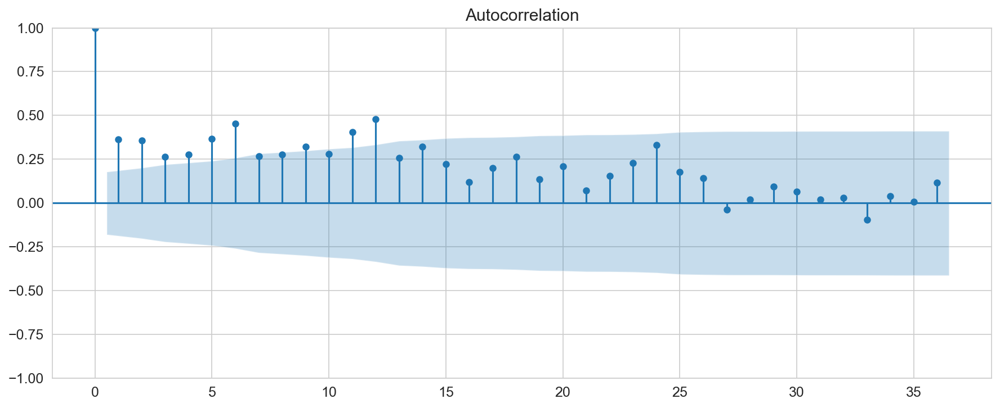
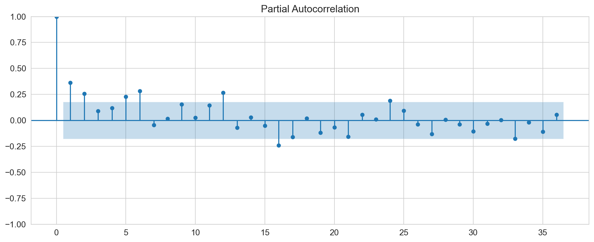
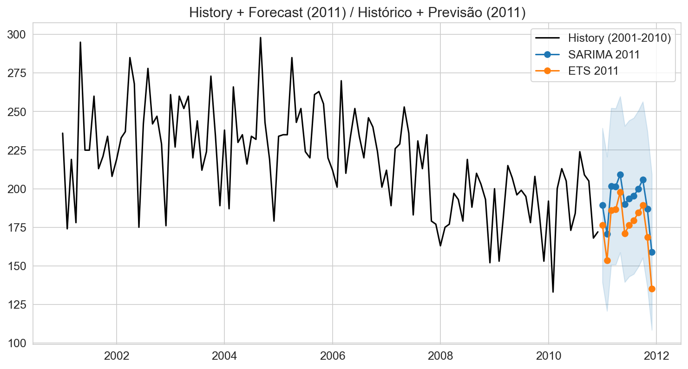

# Project History and Motivation
This project originated from a critical review of an Undergraduate Scientific Research paper, which analyzed the temporal evolution of Pulmonary Tuberculosis cases in the state of Maranhão, Brazil. Although the original study was conducted with limited resources and amateur knowledge/experience, it contained a solid foundation and the potential to be transformed into a modern, reproducible, and methodologically rigorous analysis.

The motivation behind this reconstruction is precisely to reconstruct this original study using contemporary Data Science tools, such as Python, Jupyter Notebook, and appropriate statistical libraries (e.g., pandas, statsmodels, matplotlib, scikit-learn). This involves applying current best practices in Exploratory Data Analysis (EDA), temporal validation, time series modeling, and documentation.

This endeavor is, therefore, a complete re-implementation aimed at technical training, professional demonstration, and portfolio building. It preserves the original epidemiological theme while elevating the analytical rigor, methodological transparency, and visual quality of the results.
This project does not replace the original academic study but complements it, offering an updated, reproducible, and modern version aligned with the expectations of a contemporary Data Scientist.

# Introduction

Pulmonary Tuberculosis (PT) is an infectious disease caused by the bacillus Mycobacterium tuberculosis, characterized by moderate infectivity and low pathogenicity. While it primarily affects the lungs, it can spread to other organs, such as bones, intestines, and kidneys (non-pulmonary forms).

The main symptoms of the disease include chronic cough, blood-tinged sputum, fever, night sweats, and weight loss. In some cases, the disease can remain in a latent state, manifesting symptoms long after the initial infection. Beyond the molecular biology of the etiologic agent, factors influencing the disease's transmissibility include the host's genetic or immunological characteristics, and various social determinants, such as quality of life, sanitation infrastructure, and cultural practices, among others (KUMA et al., 2007).

Brazil, like the rest of the world, has suffered the impact of tuberculosis incidence, particularly in the late 19th and early 20th centuries, when half of all infected individuals died. It was only in 1882, when Koch confirmed the existence of Mycobacterium tuberculosis, that the causality of the disease could be determined. However, the first effective treatments only became available almost half a century later.

Despite these advances, the incidence of PT remains significant in Brazil (with approximately 80,000 new cases per year), resulting in an annual mortality of almost 6,000 deaths. In the state of Maranhão alone, there was a record of 28,613 notified PT cases between 2001 and 2010. Therefore, developing new technologies and studies that enable the control, prevention, and treatment of tuberculosis is fundamental.

The study of Time Series is widely used in epidemiology, as this methodology provides essential components such as Trend and Seasonal Variation. The Trend is an estimation of the succession of data over time, while Seasonality describes variations relative to the trend across regular time periods.

Determining these components allows for the prediction, with a certain degree of accuracy, of the number of cases in an epidemic for periods beyond the observation period (horizons). This accuracy depends on several factors and limitations, notably:
* Reliability of the Data: The researcher cannot control for errors related to data collection, entry, and other steps carried out by the statistical research entity.
* Prediction Horizon: It is not possible to obtain reliable forecasts for long periods. On average, ten years of observation are required to accurately estimate the occurrence for a single year (MONTARROYOS, 2005).
* Model Selection: The accuracy is highly dependent on the model used for time series construction, which itself relies on the knowledge concerning the trend, seasonality, and random variation of the data.

There is a history of successful research in health planning and policy, such as the work by FERRÓN et al. (1999), who analyzed environmental factors influencing patient admissions to hospitals and emergency services. Developed by the Madrid Public Health University Center, the authors calculated a demand prediction and successfully associated the admission of patients due to cardiovascular, organic, and respiratory reasons at the Juan Canalejo hospital. Among other findings, they concluded there was a considerable increase in admissions between the 11th and 14th day following a drop in maximum or minimum temperature. This was made possible through the application of an ARIMA model (Auto-Regressive Integrated Moving Average).

In the field of epidemiology, we can cite the work of MONTARROYOS (2005), who compared temporal models to obtain the best estimate for the incidence of meningococcal diseases in Recife. Among other findings, he observed a higher incidence among males and an average increase of 1.2% per year during the study period, concluding that incidence increased in the months leading up to June, with a better prediction obtained through the SARIMA model (Seasonal Auto-Regressive Integrated Moving Average).

Furthermore, in the area of environmental epidemiology, GOLDBERG et al. (2001) associated daily mortality from specific causes with ozone concentration levels. This study concluded that an increase in these levels directly contributes to the incidence of deaths from cardiorespiratory diseases.

The proper construction of a temporal model for a specific epidemic over a certain observation period is, therefore, of great value to public health control entities, given the possibility of understanding the behavior of an epidemic with some precision during a determined timeframe. Thus, the present re-implementation seeks to perform a data analysis to examine the temporal trends of pulmonary tuberculosis incidence in the state of Maranhão during the period from 2001 to 2010, thereby facilitating the prediction, prevention, and control of the disease by competent authorities. More specifically, we will organize the data, perform exploratory data analysis (EDA), fit time series models to forecast future incidence rates, genereate interpretable visualizations of the results and discuss the findings in the context of public health.

# Materials and Methods

### Study Design and Data Sources

A descriptive study was conducted, using information on the detection of pulmonary tuberculosis cases and human development across the 217 municipalities of the state of Maranhão, covering the period from January 2001 to December 2010.

The number of detected cases of pulmonary tuberculosis during this period was sourced from the National Notifiable Diseases Information System (SINAN) of the Ministry of Health.

### Exploratory Analysis and Stationarity

The aggregated time series underwent an Initial Exploratory Analysis, including graphical visualization to identify trend (long-term growth or decline) and seasonality (annual repeating patterns).
Subsequently, Stationarity Tests were performed to verify if the series' statistical properties (mean and variance) remained constant over time, a prerequisite for applying Box-Jenkins models (ARIMA/SARIMA).
- Augmented Dickey-Fuller (ADF) Test: Used to test for the presence of a unit root (non-stationarity).
- Kwiatkowski-Phillips-Schmidt-Shin (KPSS) Test: Used to test for stationarity around a mean level or deterministic trend.

If the series was deemed non-stationary, differentiation ($d$ and $D$) was applied until stationarity was achieved.

### Predictive Modeling

To obtain projections of pulmonary tuberculosis incidence, two robust time series models were employed: the SARIMA (Seasonal AutoRegressive Integrated Moving Average) and the ETS (Error, Trend, Seasonality - Seasonal Holt-Winters Exponential Smoothing) model.

#### Train and Test Split

The time series was divided into the following datasets for modeling and validation:
- Training Set (Train): January 2001 to December 2009. Used to fit and train the models.
- Testing Set (Test): January 2010 to December 2010 (12 months). Used to validate the predictive performance of the models on unseen real-world data.

#### SARIMA Model and Optimization (Grid Search)

The SARIMA model $\mathbf{(p, d, q) \times (P, D, Q)_s}$ was selected for its capacity to handle both non-seasonal and seasonal components. Hyperparameter optimization was conducted via a limited Grid Search.
- Search Parameters: Combinations were tested across the following ranges ($s=12$ was fixed as the seasonal period):

$$p, q \in \{0, 1, 2\}, \quad d \in \{0, 1\}, \quad P, Q \in \{0, 1\}, \quad D \in \{0, 1\}$$

- Best Model Selection: For each combination, the model was fitted on the Training Set, and its performance was evaluated on the Test Set (2010). The model yielding the lowest RMSE (Root Mean Squared Error) on the test set was selected as the optimal candidate.

#### ETS Model (Seasonal Holt-Winters)

The ETS model was utilized as a baseline for comparison, employing a standard configuration of Additive Trend and Additive Seasonality, suitable for series with constant seasonal fluctuations.

### Evaluation and Final Results

The performance of the optimized SARIMA and ETS models was quantified on the Test Set (2010) using three key error metrics:
- Mean Absolute Error (MAE): The average of the absolute errors.
- Root Mean Squared Error (RMSE): More sensitive to large errors/outliers.
- Mean Absolute Percentage Error (MAPE): Error expressed as a percentage, aiding practical interpretation.

The model with the lowest RMSE was considered superior. The chosen model was then refitted on the full Training Set and used to generate the final forecast for the period of January to December 2011, including a 95% Confidence Interval.

### Tools and Software

The entire analysis was performed using the Python programming language, relying on the following key libraries:
- `pandas` and `numpy`: Data manipulation and numerical computation.
- `statsmodels` (modules SARIMAX, adfuller, kpss): SARIMA modeling and statistical testing.
- `statsmodels.tsa.api` (ExponentialSmoothing): ETS modeling.
- `sklearn.metrics`: Calculation of error metrics (MAE, RMSE, MAPE).
- `matplotlib`: Visualization and plotting of results.

# Results and Discussion

  
  
Figure X: Monthly distribution of cases by month-of-year

  
  
Figura X: Heatmap: Year x Month cases

  
  
Figura X: Histogram of monthly cases

